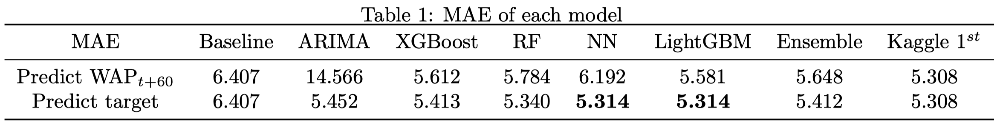
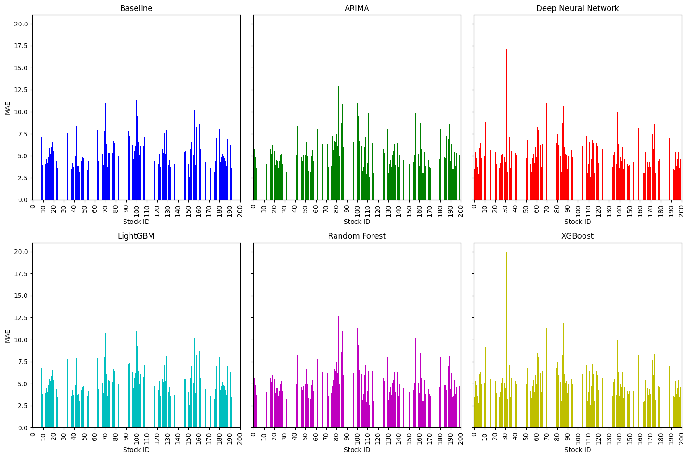
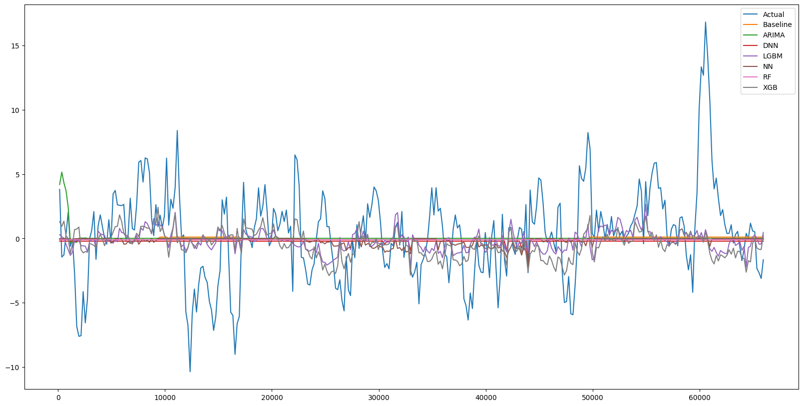
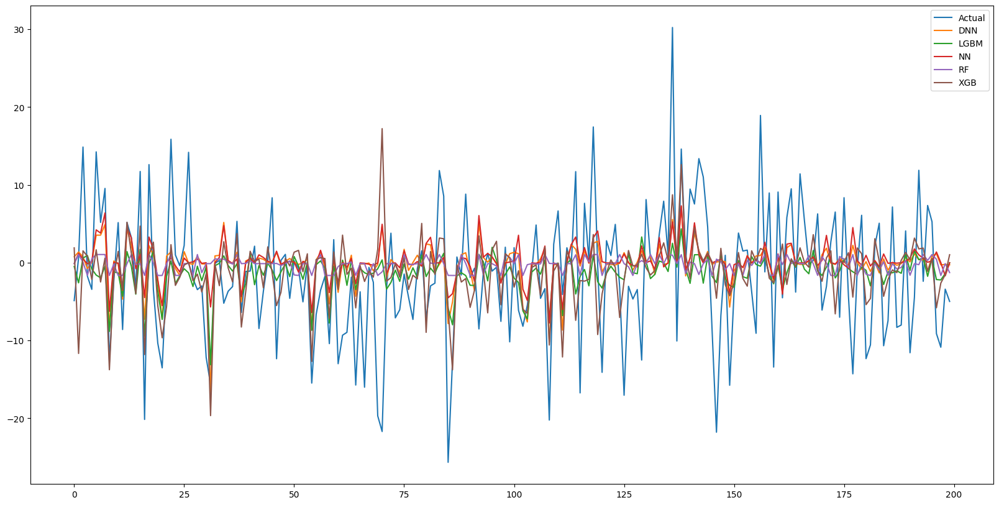
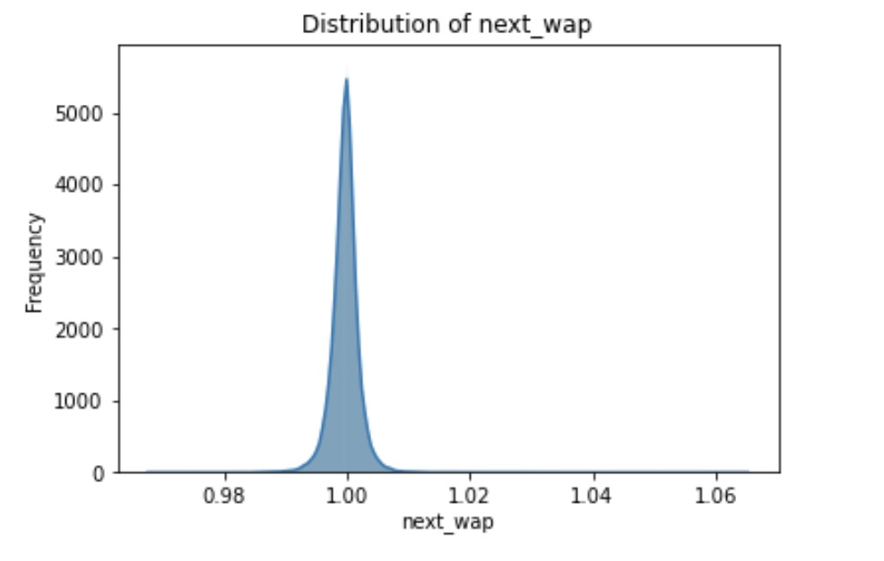
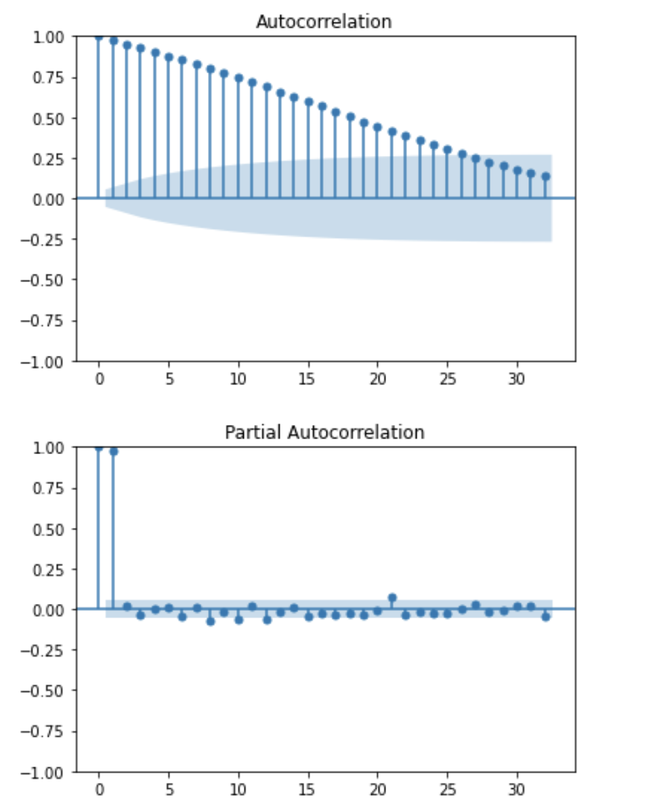

# NASDAQ Closing Stock Price Prediction
Final Project - 15.072 Advanced Analytics Edge @MIT

Project Members: [Zeki Yan](https://www.linkedin.com/in/zikaiyan/), [Meredith Gao](https://www.linkedin.com/in/mingtian-gao-484749290/), [Lucas Goh](https://www.linkedin.com/in/lucas-goh/), [Tim Zhou](https://www.linkedin.com/in/dingyi-zhou/)

## Introduction

Stock exchanges experience high intensity and volatility, especially in the final ten minutes of the trading day, significantly influencing global economic narratives due to rapid price fluctuations and high stakes. During the final ten minutes of the Nasdaq exchange trading session, market makers (such as Optiver) combine data from traditional order books with auction book data. Merging information from these two sources is essential to offering optimal prices to all market participants.

In this project, using data from the auction, we aim to develop models that can predict the closing movements of the Nasdaq Closing Cross auction.

## Data

Our dataset provides historical data for the daily ten-minute closing auctions on the NASDAQ stock exchange. The data encompasses 200 selected stocks, sampled at ten-second intervals. The dataset is sourced from the [Optiver Trading at the Close](https://www.kaggle.com/competitions/optiver-trading-at-the-close) competition hosted on Kaggle. The data that we used is a 30-day sample of the original dataset due to computing resource limitations, using an 80-20 train-test split. Our training dataset comprises a total of 264,000 rows, covering the first 24 days while our testing data covers the last 6 days with 66,000 rows.

## Methodology

### Approach 1: Calculate Target by Predicting its Core Components

We focused on predicting the core components of the target, specifically $WAP_{t+60}$ and Index $WAP_{t+60}$. $WAP$ can be calculated as following formula:
$$
WAP = \frac{BidPrice \times AskSize + AskPrice \times BidSize}{BidSize + AskSize}
$$

The process involved several key steps:

- **Retrieving Stock Weights $w_i$ for $Index \, WAP$**: $Index \, WAP$ is a weighted sum of all 200 stocks' WAP. By applying linear regression ($R^2$ of 1.0) to the given WAP of all stocks, we successfully determined the precise weights constituting the index.
- **Imputing Last-Minute WAP**: For each day, we only had WAP values for the first nine minutes, we used $target_t$ and $Index \, WAP_t$ which contain information of $WAP_{t+60}$ to impute the last-minute WAP by solving a linear optimization model on Gurobi. Distribution of imputed data is shown in appendix, which aligns with its nature of fluctuating around 1. This provided us with a complete set of $WAP_{t+60}$​ labels for prediction.
- **Predicting $WAP_{t+60}$**: Each model described in section 6 was trained using the training dataset, employing $WAP_{t+60}$ as the labels. Predictions for $WAP_{t+60}$ were then made for every $t$ and every stock for the testing dataset. Subsequently, we calculated the targets using the following formula:

$$
target_t = \left( \frac{Stock \, WAP_{t+60}}{Stock \, WAP_t} - \frac{Index \, WAP_{t+60}}{Index \, WAP_t} \right) \times 10000
$$

- **Limitation on Predictive Accuracy**: Despite our efforts, the efficacy of this method was constrained, as indicated by a Mean Absolute Error (MAE) of over 5.5 in all models. This suboptimal performance is likely attributable to the intricate interactions among various stocks, which cannot be assumed to operate independently.

### Approach 2: Directly Predict Target

Our alternative strategy adopts a more straightforward and surprisingly more effective method by focusing directly on predicting the $target$ variable. This method deviates from complex multi-step processes and instead concentrates on the direct estimation of the $target$. The results, demonstrating the effectiveness and efficiency of this direct prediction strategy, are outlined in detail in later sections. This approach simplifies the prediction process while enhancing the accuracy and reliability of the predictions, as evidenced by the results we have compiled and analyzed.

## Feature Engineering

Feature generation involves four main categories of features.

- **Stock summary features**: including median and standard deviation of price/size
- **Cross-combined features**: calculating ratios/products of price/size attributes
- **Combinations of price features**: various two/three-price combinations
- **Advanced features**: shift/return, time, and stock-related attributes

This comprehensive approach provides a rich set of data for informed decision-making in the stock market.

## Prediction Models

We used the following models.

- **ARIMA**: Combines three main components: autoregression (AR), differencing (I), and moving average (MA). It is a popular model used for forecasting complex and non-stationary time series data and a good choice for predicting stock closing prices. Here we used ARIMA(2,0,0) to fit $WAP$ based on its ACF and PACF plots shown in the appendix. For fitting the $target$, we opted for automatic parameter selection due to the distinct patterns observed in each stock's $target$​.
- **XGBoost**: Builds and combines multiple decision trees sequentially, with each tree correcting the errors of its predecessor. It is effective in capturing complex, non-linear patterns in data.
- **Random Forest**: An ensemble learning method that constructs multiple decision trees during training and outputs the mode of their predictions. It has the ability to reduce overfitting while capturing complex patterns in data.
- **Neural Networks**: computational models consisting of interconnected nodes or neurons. Through a process of learning from the input data, they excel in identifying intricate patterns and relationships in large datasets, such as stock market trends.
- **LightGBM**: A gradient boosting framework that uses tree-based learning algorithms. It also has good ability to work with large numbers of features and data points.
- **Ensemble**: fit a linear regression model to fit the target value by the combination of all the models' prediction results based on the training set, and make the prediction on the test set based on each models' prediction on the test set and the fitted linear regression model.

## Results and Analysis

Our predictive accuracy is measured using the Mean Absolute Error (MAE), with a lower MAE indicating higher precision. 

As shown in the Table 1, our initial strategy involved predicting $WAP_{t+60}$ and then utilizing this prediction to compute the target, but this approach did not yield satisfactory results.

Subsequently, we opted to predict the target value directly, a decision that led to considerably improved outcomes. Our most effective models are LightGBM and Neural Networks, both achieving the lowest MAE of **5.314** among all tested models. These models are closely followed by Random Forest, XGBoost, and ARIMA. Compared to the baseline model, our top-performing model shows a **17.1%** improvement in MAE but is marginally outperformed by **1.1%** compared to the Kaggle 1st Place model.

Each Model's MAE for each stock is shown below:

As shown in the above figure, we computed and visualized the MAE for each stock using test set data across six models. Generally, the models exhibited similar patterns, indicating that some stocks consistently present challenges in prediction, regardless of the model used.

The above figure illustrates the comparison between the actual target values for stock 151 and the predicted targets from various models. The actual target line shows instances of high volatility, which are characterized by significant spikes. The graph analysis reveals that the NN and LGBM models exhibit the most significant fluctuations around the zero baseline, closely aligning with the actual target's high instability, suggesting their high performance in predicting stock 151's movements.

## Business Impact

Closing prices are critical for investors, analysts, and market stakeholders, serving as key indicators for assessing securities' performance and understanding the broader market. Our model enhances this aspect by effectively consolidating signals from auctions and order books, offering a more accurate market snapshot. The prediction results help reduce information asymmetry, aiding informed decision-making and enhancing market transparency. Moreover, our model goes beyond mere supply and demand dynamics, enabling rational, well-informed trading strategies. It not only aids individual investors but also contributes to the overall integrity and functioning of financial markets.

## Appendix

